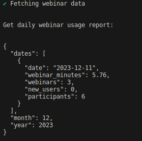

# webinarDailyUsage

> **Note**
>
> The following sample application is a personal, open-source project shared by the app creator and not an officially supported Zoom Video Communications, Inc. sample application. Zoom Video Communications, Inc., its employees and affiliates are not responsible for the use and maintenance of this application. Please use this sample application for inspiration, exploration and experimentation at your own risk and enjoyment. You may reach out to the app creator and broader Zoom Developer community on https://devforum.zoom.us/ for technical discussion and assistance, but understand there is no service level agreement support for this application. Thank you and happy coding!

Zoom Webinar Daily Usage Report

**Getting Started:**

1. Install docker and make sure it is running https://docs.docker.com/engine/install/
2. Modify the .env file with your zoom S2S credentials
   - Scopes required:
     - dashboard_webinars:read:admin
3. Run `docker compose run --rm --build app`
4. Enjoy!
